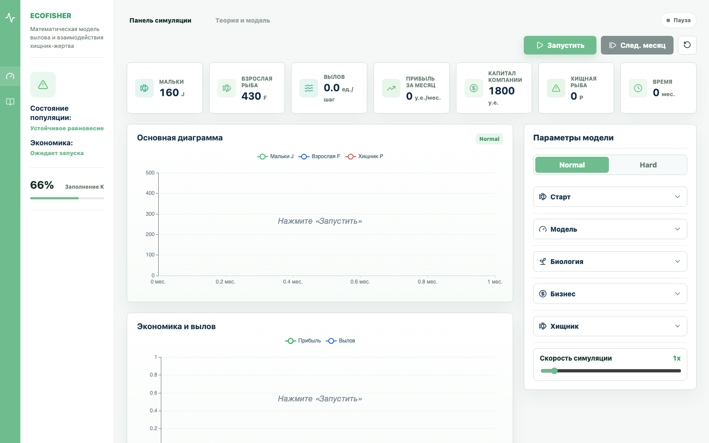
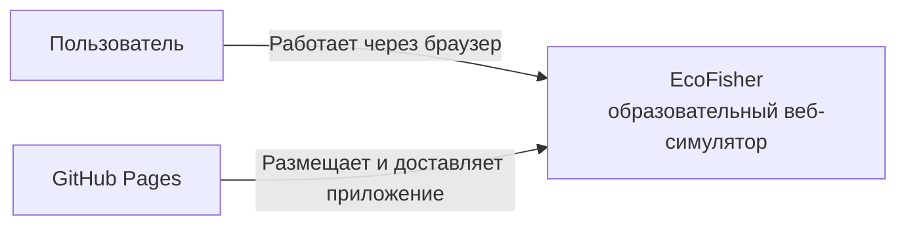
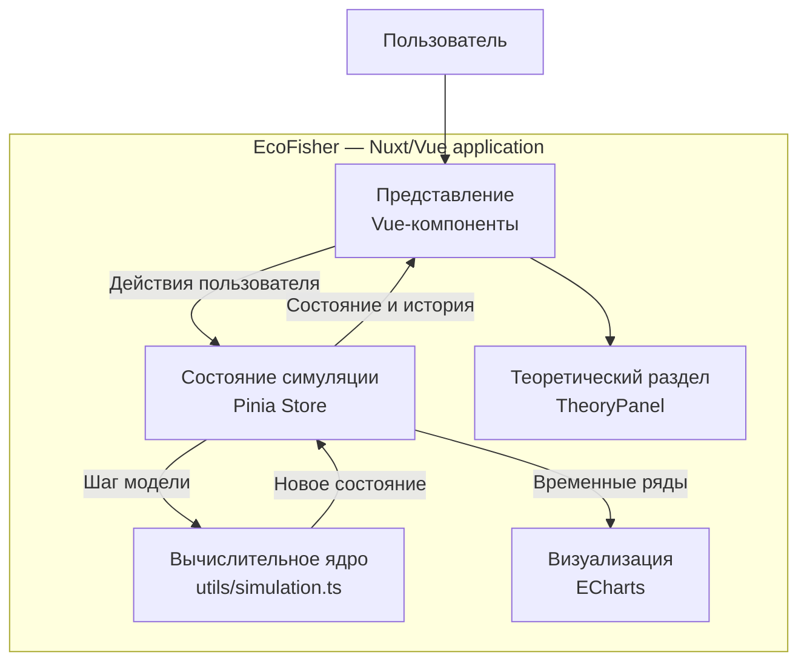
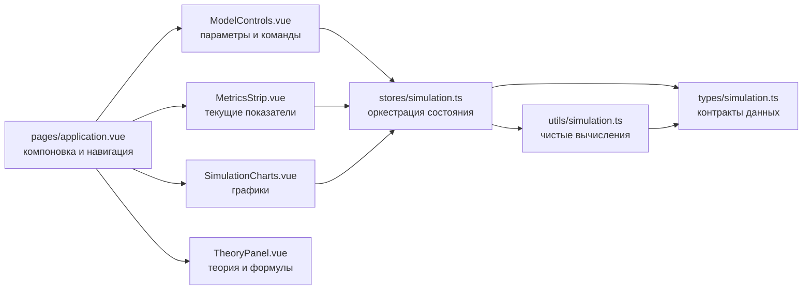

<div align="center">

# EcoFisher

### Интерактивный симулятор устойчивого управления рыбным хозяйством

**Управляйте зарыблением и выловом, сохраняйте популяцию рыбы и развивайте прибыльное хозяйство.**

[Открыть симулятор](https://puzyrnikovdanya.github.io/Web--EcoFisher-Sustainable-Aquaculture-Simulator/)

</div>



---

## Оглавление

- [Для пользователя](#для-пользователя)
  - [Зачем нужен EcoFisher](#зачем-нужен-ecofisher)
  - [Возможности](#возможности)
  - [Режимы симуляции](#режимы-симуляции)
  - [Как пользоваться](#как-пользоваться)
  - [Что показывает интерфейс](#что-показывает-интерфейс)
  - [Теория и математическая модель](#теория-и-математическая-модель)
- [Для разработчика](#для-разработчика)
  - [Технологический стек](#технологический-стек)
  - [Архитектура](#архитектура)
  - [Поток данных](#поток-данных)
  - [Реализация математической модели](#реализация-математической-модели)
  - [Структура проекта](#структура-проекта)
  - [Локальный запуск](#локальный-запуск)
  - [Сборка и публикация](#сборка-и-публикация)
  - [Особенности реализации](#особенности-реализации)

---

# Для пользователя

## Зачем нужен EcoFisher

Что произойдет, если увеличить вылов в два раза? Всегда ли дополнительное зарыбление спасает озеро? Сможет ли хозяйство оставаться прибыльным, если в экосистеме появится хищная рыба?

**EcoFisher** превращает эти вопросы в интерактивный эксперимент. Вместо статичной формулы пользователь получает живую модель рыбного хозяйства: меняет параметры, запускает время и сразу видит последствия решений на графиках популяции и экономики.

В симуляторе одновременно взаимодействуют:

- мальки и взрослая рыба;
- естественное размножение, взросление и смертность;
- ограниченная вместимость озера;
- зарыбление и промысловый вылов;
- прибыль за месяц и накопленный капитал;
- хищная рыба в усложнённом режиме.

Проект помогает наглядно понять, как дифференциальные уравнения описывают реальные динамические системы и почему выгодное решение в текущем месяце может оказаться опасным в долгосрочной перспективе.

## Возможности

| Что можно делать | Что происходит в модели |
|---|---|
| Выбирать режим `Normal` или `Hard` | В Hard-режиме добавляется динамика хищников |
| Задавать стартовую популяцию | Настраиваются мальки, взрослая рыба и, в Hard, хищники |
| Изменять начальный капитал | Можно сравнивать стратегии с разным финансовым запасом |
| Управлять зарыблением | В озеро добавляются мальки, которым требуется время для взросления |
| Управлять усилием вылова | Больший вылов повышает текущую выручку, но сокращает кормовую и воспроизводственную базу |
| Настраивать биологические коэффициенты | Меняются рост, смертность, взросление и вместимость озера |
| Настраивать экономику | Меняются цена рыбы, стоимость вылова и стоимость зарыбления |
| Управлять хищниками | Можно менять параметры хищничества и добавлять хищную рыбу |
| Запускать симуляцию автоматически | Один месяц моделирования проходит каждую секунду при скорости `1x` |
| Продвигать модель вручную | Кнопка `След. месяц` выполняет ровно один шаг |
| Следить за графиками | Отображаются мальки, взрослая рыба, хищники, прибыль и вылов |
| Получать оценку стратегии | Интерфейс показывает состояние популяции и экономики |
| Изучать теорию | Встроенный раздел объясняет модели вылова и «хищник-жертва» |

## Режимы симуляции

### Normal

Базовый режим для изучения устойчивого вылова. Пользователь балансирует между пополнением озера, промысловой нагрузкой и расходами предприятия.

Подходит для первого знакомства с моделью и поиска стратегии, при которой хозяйство получает прибыль, а популяция не истощается.

### Hard

К базовой системе добавляется хищная рыба. Хищники уменьшают численность взрослой рыбы, зависят от доступной кормовой базы и способны нарушить найденное ранее равновесие.

Этот режим показывает, что устойчивое управление природным ресурсом зависит не только от решений предприятия, но и от связей внутри экосистемы.

## Как пользоваться

1. Откройте [EcoFisher](https://puzyrnikovdanya.github.io/Web--EcoFisher-Sustainable-Aquaculture-Simulator/).
2. Выберите режим `Normal` или `Hard` в панели **Параметры модели**.
3. Раскройте раздел **Старт** и задайте начальное количество мальков, взрослой рыбы, вместимость озера `K` и капитал. В Hard-режиме также задайте количество хищников.
4. В разделе **Биология** настройте характеристики роста, взросления и смертности популяции.
5. В разделе **Бизнес** выберите усилие вылова `E`, объем зарыбления `S`, цену и затраты.
6. Для Hard-режима настройте раздел **Хищник** или добавьте хищную рыбу в уже работающую систему.
7. Нажмите **Запустить** для автоматической симуляции либо **След. месяц** для пошагового эксперимента.
8. Сравнивайте графики популяции и экономики. Следите не только за прибылью, но и за численностью взрослой рыбы.
9. Меняйте стратегию во время эксперимента и наблюдайте, как система ищет новое равновесие.
10. Нажмите кнопку сброса, чтобы вернуть исходные параметры и начать новый сценарий.

> Хорошая стратегия не обязательно дает максимальную прибыль в первый месяц. Цель — найти режим, который сохраняет ресурс и остается экономически устойчивым на длинном горизонте.

## Что показывает интерфейс

### Ключевые показатели

- **Мальки `J`** — молодая часть популяции, которая со временем переходит во взрослую.
- **Взрослая рыба `F`** — воспроизводственная база и единственная часть популяции, доступная для вылова.
- **Хищная рыба `P`** — дополнительное давление на взрослую рыбу в Hard-режиме.
- **Вылов `H`** — количество взрослой рыбы, добытое за текущий шаг.
- **Прибыль за месяц** — доход от продажи улова за вычетом затрат.
- **Капитал компании** — накопленный финансовый результат за всю симуляцию.
- **Время** — количество прошедших модельных месяцев.

### Графики

**Основная диаграмма** показывает траектории мальков, взрослой и хищной рыбы. Цвета линий различаются, а вместимость озера отмечается уровнем `K`.

**Экономика и вылов** позволяет сравнить текущую прибыль и объем добычи на всем прошедшем периоде симуляции.

### Состояние системы

Симулятор анализирует динамику и выводит краткую оценку:

- устойчивое равновесие;
- активный рост или сокращение популяции;
- критическая угроза вымирания;
- перенаселение озера;
- доминирование хищников;
- экономические убытки, рост или стабилизация прибыли.

Если допустимая вместимость озера превышена, лишняя рыба погибает, но расходы на зарыбление сохраняются.

## Теория и математическая модель

Раздел **Теория и модель** встроен прямо в приложение. Он последовательно объясняет:

1. логистический рост популяции и ограничение вместимости озера;
2. влияние промыслового вылова;
3. классическую идею модели «хищник-жертва»;
4. систему уравнений, используемую в режимах Normal и Hard;
5. назначение каждого параметра модели;
6. расчет вылова, прибыли и капитала.

Пользователю не требуется заранее знать теорию дифференциальных уравнений: обозначения расшифрованы, а формулы связаны с конкретными элементами интерфейса.

---

# Для разработчика

## Технологический стек

[](https://nuxt.com/)
[](https://vuejs.org/)
[](https://www.typescriptlang.org/)

| Категория | Технология | Назначение |
|---|---|---|
| Фреймворк | Nuxt 3 | Структура приложения, маршрутизация и сборка |
| UI | Vue 3 Composition API | Реактивные компоненты интерфейса |
| Язык | TypeScript | Типизация параметров, состояния и вычислений |
| Состояние | Pinia | Единое состояние симуляции и управление временем |
| Графики | Apache ECharts | Интерактивная визуализация временных рядов |
| Иконки | Lucide Vue | Иконки элементов управления и показателей |
| Математический прототип | Python 3 | Независимая реализация и проверка модели |
| Пакетный менеджер | npm | Установка зависимостей и запуск сценариев |
| CI/CD | GitHub Actions | Автоматическая сборка и публикация |
| Хостинг | GitHub Pages | Размещение статически сгенерированного приложения |

Приложение не использует сервер, API или базу данных. Рабочая TypeScript-модель полностью выполняется в браузере пользователя.

## Архитектура

### Уровень 1: контекст системы — C4 Context



Пользователь взаимодействует с EcoFisher через браузер. После загрузки приложения все вычисления выполняются локально; внешние сервисы не участвуют в процессе симуляции.

### Уровень 2: контейнеры — C4 Container



### Уровень 3: компоненты приложения — C4 Component



## Поток данных

```text
Пользователь изменяет ползунок
        ↓
ModelControls обновляет параметры в Pinia
        ↓
Store запускает simulateStep(state, params)
        ↓
Вычислительное ядро возвращает новое SimulationState
        ↓
Store обновляет текущее состояние и добавляет HistoryPoint
        ↓
MetricsStrip обновляет показатели
SimulationCharts перестраивает линии ECharts
Статусы популяции и экономики пересчитываются автоматически
```

Разделение ответственности построено следующим образом:

- компоненты отвечают за отображение и пользовательский ввод;
- Pinia Store управляет жизненным циклом симуляции, таймером и историей;
- `utils/simulation.ts` содержит вычисления без зависимости от интерфейса;
- `types/simulation.ts` задает единые типы параметров и состояния;
- ECharts получает готовые временные ряды и не участвует в расчетах модели.

## Реализация математической модели

### Normal Mode

$$
\frac{dJ}{dt}=rF\left(1-\frac{F}{K}\right)-\mu J-gJ+S
$$

$$
\frac{dF}{dt}=gJ-H-\delta F
$$

### Hard Mode

В Hard-режиме к динамике взрослой рыбы добавляется хищничество, а к состоянию — популяция хищника:

$$
\frac{dF}{dt}=gJ-H-\delta F-bFP
$$

$$
\frac{dP}{dt}=-mP+dFP
$$

При достаточной кормовой базе действует игровое ограничение сохранения хищников:

$$
P \geq P_{min}, \quad \text{если } F > F_{food}
$$

### Вылов и экономика

$$
H=\min(qEF,F)
$$

$$
Profit=pH-cE-sS
$$

$$
Capital_{t+1}=Capital_t+Profit\cdot dt
$$

Ограничение `min(qEF, F)` не позволяет выловить больше взрослой рыбы, чем находится в озере.

### Численное интегрирование

Модель обновляется дискретными шагами методом Эйлера:

$$
X_{t+1}=X_t+\frac{dX}{dt}\cdot dt
$$

После каждого шага выполняются дополнительные игровые проверки:

1. отрицательные значения популяций заменяются нулем;
2. если `J + F > K`, обе популяции пропорционально сокращаются до вместимости озера;
3. в Normal-режиме количество хищников всегда равно нулю;
4. в Hard-режиме хищники поддерживаются на минимальном уровне при достаточной кормовой базе;
5. рассчитываются вылов, месячная прибыль, капитал и состояние популяции.

### TypeScript и Python

Рабочая модель интерфейса реализована в [`utils/simulation.ts`](utils/simulation.ts). Именно она выполняется в браузере и обновляет приложение.

Файл [`model/ecofisher_model.py`](model/ecofisher_model.py) содержит независимую Python-реализацию той же системы. Он используется как читаемый математический прототип и позволяет проверять поведение модели отдельно от Vue-интерфейса.

## Структура проекта

```text
EcoFisher/
├── .github/workflows/
│   └── deploy.yml              # публикация на GitHub Pages
├── assets/css/
│   └── main.css                # глобальные стили и дизайн-токены
├── components/
│   ├── MetricsStrip.vue        # карточки текущих показателей
│   ├── ModelControls.vue       # параметры и управление симуляцией
│   ├── SimulationCharts.vue    # графики ECharts
│   └── TheoryPanel.vue         # теория и математическое описание
├── docs/images/                # изображения для документации
├── model/
│   └── ecofisher_model.py      # Python-версия математической модели
├── pages/
│   ├── application.vue         # основная страница приложения
│   └── index.vue               # перенаправление в симулятор
├── plugins/
│   └── vue-devtools.client.ts  # интеграция Vue DevTools
├── public/
│   └── favicon.svg
├── scripts/
│   └── serve-static.mjs        # локальная раздача static-сборки
├── stores/
│   └── simulation.ts           # Pinia Store и цикл симуляции
├── types/
│   └── simulation.ts           # типы параметров и состояния
├── utils/
│   └── simulation.ts           # вычислительное ядро
├── app.vue
├── nuxt.config.ts
├── package.json
└── tsconfig.json
```

## Локальный запуск

### Требования

- Node.js `20.19.0` или новее;
- npm;
- современный браузер.

### Установка

```bash
git clone https://github.com/Puzyrnikovdanya/Web--EcoFisher-Sustainable-Aquaculture-Simulator.git
cd Web--EcoFisher-Sustainable-Aquaculture-Simulator
npm install
```

### Режим разработки

```bash
npm run dev
```

После запуска приложение доступно по адресу:

```text
http://127.0.0.1:3000/application
```

Если порт `3000` занят, Nuxt автоматически предложит другой свободный порт.

### Production-сборка

```bash
npm run build
npm run preview
```

### Статическая генерация

```bash
npm run generate
npm run serve:static
```

Сгенерированные файлы находятся в `.output/public`.

### Запуск Python-модели

```bash
python3 model/ecofisher_model.py
```

Команда выводит в терминал последовательность состояний модели для тестового Hard-сценария.

## Сборка и публикация

[](https://github.com/Puzyrnikovdanya/Web--EcoFisher-Sustainable-Aquaculture-Simulator/actions/workflows/deploy.yml)
[](https://puzyrnikovdanya.github.io/Web--EcoFisher-Sustainable-Aquaculture-Simulator/)

Публичная версия размещается на GitHub Pages. Workflow [`.github/workflows/deploy.yml`](.github/workflows/deploy.yml) автоматически выполняется после каждого push в ветку `main`:

1. устанавливает Node.js из `.nvmrc`;
2. устанавливает зависимости через `npm ci`;
3. запускает `npm run generate`;
4. передает `.output/public` в GitHub Pages;
5. публикует новую версию сайта.

Для корректной работы внутри подкаталога репозитория `nuxt.config.ts` получает `NUXT_APP_BASE_URL` во время CI-сборки.

## Особенности реализации

- Симуляция полностью детерминирована: одинаковые параметры и стартовое состояние дают одинаковую траекторию.
- История хранится в памяти браузера и сбрасывается при перезагрузке страницы.
- Серверная часть, аккаунты и база данных не используются.
- Скорость управляет количеством модельных месяцев за одну секунду реального времени.
- Статусы интерфейса являются интерпретацией текущей динамики и не входят напрямую в систему дифференциальных уравнений.
- Python-файл не вызывается из браузера: рабочая web-реализация находится в TypeScript.

---

## Автор

**Даниил Пузырников**

EcoFisher разработан как учебный проект по моделированию рыбного хозяйства и демонстрации практического применения дифференциальных уравнений.
